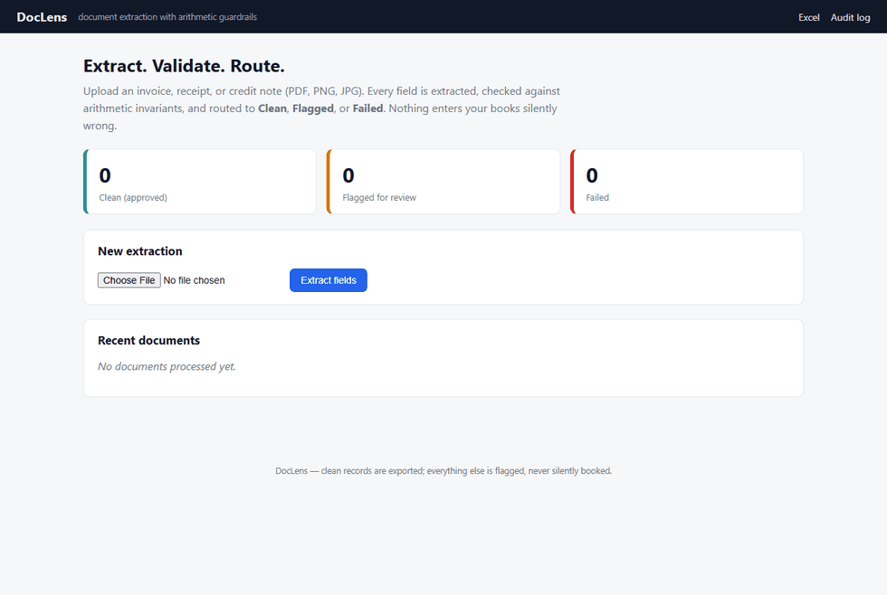

# DocLens

Invoice, receipt, and credit-note extraction with **arithmetic guardrails** a vision LLM reads any layout, then deterministic rules decide whether your books can trust the numbers.



**Live demo:** [doclenss.onrender.com](https://doclenss.onrender.com) · free tier, so the first load after 15 idle minutes spins up for ~50 seconds, and uploaded data is disposable.

## Why it exists

Accounts-payable teams can't paste raw documents into a chatbot: a confidently-wrong total silently corrupts the books. DocLens treats the model as a *reader*, not an authority — every extraction must survive mechanical checks (do the line items sum? does subtotal + tax equal the total? has this invoice been seen before?) before it's allowed near an export. Records that pass are auto-exported; everything else lands in a review queue with the exact failing rule highlighted.

## What you get

- **Structured fields from any layout** — PDFs, scans, photos, and Word docs all take the same path; one schema-driven extractor instead of per-vendor templates
- **Low-confidence flagging** — two independent sources: the model declares uncertain fields, and 13 deterministic rules re-check its work
- **Duplicate detection** — identical files, repeated invoice numbers from look-alike vendors, and same-vendor/same-amount resubmissions under new numbers all get caught against processing history
- **Policy controls** — totals above `AUTO_APPROVE_MAX` always route to human review, even when every check passes
- **Real destinations** — styled Excel workbook (Summary + LineItems sheets) and optional signed-webhook POST for clean records
- **Full auditability** — SHA-256 of every source file, raw model response, per-rule findings, review state; exportable as JSONL

## How a document flows

```
upload ─▶ ingest ─▶ vision provider ─▶ validate ─▶ route ─▶ store
PDF/img/docx   (rasterize)   (JSON out,      13 rules    ├─ approved ▶ Excel + webhook
               PyMuPDF       +1 repair       + history   ├─ flagged  ▶ review queue UI
               Pillow        retry if off-   checks      └─ failed   ▶ audit log only
                             schema)                     (everything lands in SQLite)
```

Dispositions: **approved** = zero findings, safe to post · **flagged** = usable but held with exact failing rules shown · **failed** = nothing bookable.

### Validation rules

| Rule | Check | Severity |
|---|---|---|
| V001 | required fields present (vendor, invoice #, total) | error |
| V002–V003 | dates parse as ISO; due date ≥ issue date; not future-dated | error / warning |
| V004 | amounts present but currency unknown | warning |
| V005 | Σ line items ≈ printed subtotal (tolerance-based) | error |
| V006 | printed subtotal + tax ≈ printed total | error |
| V007 | negative amounts outside credit notes | warning |
| V008 | line rows with no computable amount | warning |
| V009 | model-declared uncertain fields | warning |
| V010 | total differs from subtotal by ≥10× (magnitude misread) | warning |
| V011 | duplicate: identical file, or repeated vendor + invoice number | error |
| V012 | same vendor + amount + date under a new invoice number | warning |
| V013 | total above the `AUTO_APPROVE_MAX` policy limit | warning |

Routing runs on these outcomes — never on the model's self-reported confidence, which correlates poorly with correctness on misread digits.

## Stack

Python 3.12 · FastAPI · Pydantic v2 (schema shared with providers) · PyMuPDF + Pillow + python-docx · Gemini / OpenAI / Claude vision via plain REST (httpx, swappable) · SQLite · openpyxl · Jinja2 · pytest

## Run it locally

```bash
python -m venv .venv && source .venv/bin/activate   # Windows: .venv\Scripts\activate
pip install -r requirements.txt
cp .env.example .env          # add at least one key: GEMINI_API_KEY (free tier), OPENAI_API_KEY, or ANTHROPIC_API_KEY
uvicorn app.main:app --reload
```

<<<<<<< HEAD
Any one of `GEMINI_API_KEY` (free tier works), `OPENAI_API_KEY`, or `ANTHROPIC_API_KEY` enables extraction. Provider is auto-selected by available keys, or pinned via `PROVIDER=`.
=======
Providers are auto-selected by available keys; pin one with `PROVIDER=`.
>>>>>>> f7a6125 (Rewrite README: product-first structure, rules table, current counts)

Demo fixtures (no API key needed):

```bash
python fixtures/generate_fixtures.py
```

| Fixture | Layout |
|---|---|
| `layout_a_classic_invoice.pdf` | classic AP invoice: header block, itemized grid, totals block |
| `layout_b_receipt_style.pdf` | narrow thermal-receipt layout, EUR, inline items |
| `layout_c_word_invoice.docx` | Word-document invoice (.docx normalization path) |
| `layout_b_receipt_degraded.jpg` | rotated, blurred, noisy JPEG simulating a phone photo |

**Tests:** `python -m pytest` — 67 offline tests against a fake provider. A live end-to-end test against the real LLM is opt-in: `DOCLENS_LIVE_TEST=1` plus a provider key.

## HTTP API

| Method | Path | Purpose |
|---|---|---|
| POST | `/extract` | multipart `file` → full pipeline; returns the stored record |
| GET | `/api/documents?disposition=flagged` | list records (filterable) |
| GET | `/api/documents/{id}` | record incl. findings + raw model response |
| PATCH | `/api/documents/{id}/review` | human review decision `{review_status, review_note}` |
| GET | `/export/excel.xlsx` | Summary + LineItems workbook, color-coded dispositions |
| GET | `/export/audit-log.jsonl` | full audit trail |
| GET | `/export/webhook-deliveries.jsonl` | webhook delivery outcomes |
| GET | `/healthz` | liveness probe |

```bash
curl -F "file=@fixtures/layout_a_classic_invoice.pdf" http://127.0.0.1:8000/extract
```

## Configuration

| Variable | Default | Notes |
|---|---|---|
| `PROVIDER` | `auto` | `gemini` \| `openai` \| `anthropic` \| auto-detected by available keys |
| `*_MODEL` | `gemini-2.5-flash` / `gpt-4o-mini` / `claude-sonnet-4-5-20250929` | override to pin your provider's current version |
| `AUTO_APPROVE_MAX` | `5000` | totals above this always go to review; `0` disables |
| `MAX_PAGES` / `MAX_IMAGE_PX` | `5` / `2000` | input caps before upload |
| `DB_PATH` | `data/doclens.db` | SQLite audit store |
| `WEBHOOK_URL` / `WEBHOOK_SECRET` | — | POSTs approved records with `X-Webhook-Secret`; attempts logged |

## Deployment

Ships with `render.yaml` + `Dockerfile`. On Render: Dashboard → **New → Web Service** → connect repo → Free instance → add `GEMINI_API_KEY`. Free-tier trade-offs: sleeps after 15 idle minutes (~1 min wake-up) and the filesystem resets on restart — hosted demo data is disposable.

## Engineering decisions

1. **One schema, N layouts.** The Pydantic contract (`app/models.py`) is both the constraint sent to providers and the runtime validator — a single source of truth instead of per-vendor templates.
2. **Escape hatches over guesses.** `null` + a declared issue is a first-class outcome; the dangerous failure isn't crashing, it's a plausible wrong total.
3. **Arithmetic as the routing signal.** Reconciliation catches misreads deterministically — arithmetic doesn't have opinions.
4. **Bounded repair pass.** One re-ask with the exact schema error recovers most malformed output without unbounded retries.
5. **Provenance everywhere.** Input hashes, raw responses, findings, review state — the log answers "why did the system believe this number?" months later.

## Known limitations

- Single-node SQLite by design; multi-instance needs Postgres (`store.py` is the only module to swap).
- Validated against English/latin-script documents; other scripts need prompt and fixture coverage.
- No auth on the review UI — internal tool, don't expose it raw.
- Roadmap: reviewer-side field corrections with re-validation, per-vendor accuracy tracking from the audit log, PO 2/3-way matching.
